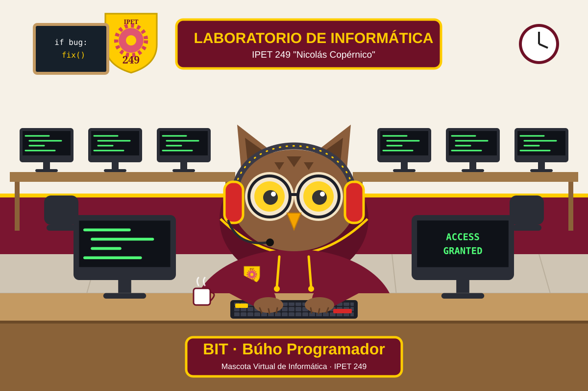

# Game Design Document (GDD) – "Bit", la Mascota Virtual de Informática

**Institución:** IPET 249 "Nicolás Copérnico" · **Especialidad:** Informática · **Asignatura:** Laboratorio de Aplicaciones II · **Año:** 2026

## 1. Concepto
Bit es un **búho programador** (el búho simboliza el conocimiento y la guardia nocturna de quien programa). Es un juego de mascota interactiva (estilo Tamagotchi / Pou) donde el jugador debe mantener a Bit con energía, ánimo y sin bugs.

## 2. Personalización institucional
- **Atributos informáticos:** anteojos redondos, auriculares gamer, laptop con código en pantalla, buzo con capucha con el símbolo `</>`.
- **Identidad institucional:** paleta bordó, amarillo, rojo y blanco; escudo del IPET 249 visible en la cabecera; escenario ambientado en la sala de computación del colegio.

## 3. Variables de estado (0 a 100)
| Variable | Equivale a | Desgaste | Cómo se recupera |
|---|---|---|---|
| Energía | Carga de batería | −1.6/s | Café (+25) |
| Ánimo | Nivel de código | −2.0/s | Programar (+7/s mientras programa) |
| Salud | Limpieza de bugs | −0.8/s (+0.4/s por cada bug en pantalla) | Limpiar bugs (+15) o clic en bugs (+8 c/u) |

## 4. Interacciones del usuario
- **1 / botón "Café":** alimenta con café y sube la energía.
- **2 / botón "Programar":** Bit programa 4 s (sube ánimo, gasta energía; necesita energía > 10).
- **3 / botón "Limpiar bugs":** sube la salud y elimina bugs.
- **Minijuego:** si la salud baja de 60 aparecen bugs que caminan por el escenario; se aplastan con clic.

## 5. Estados visuales / expresiones
| Estado | Condición (prioridad de arriba hacia abajo) | Aspecto |
|---|---|---|
| Cansada / sin batería | Energía ≤ 20 | Ojos cerrados, "Z", ícono de batería baja |
| Programando | Acción activa | Laptop con código, mira hacia abajo |
| Con bugs | Salud < 35 | Ojos en "X", boca triste |
| Triste | Ánimo < 35 | Cejas caídas, boca triste |
| Feliz | Resto de los casos | Sonrisa, ojos abiertos |

## 6. Game loop
1. Leer eventos (teclado / mouse).
2. Actualizar variables con `dt` (desgaste, bugs, animación).
3. Dibujar fondo, cabecera con escudo, barras, mascota y botones.
4. `clock.tick(60)`.

## 7. Sonido
| Evento | Archivo |
|---|---|
| Tomar café | `cafe.wav` |
| Programar | `programar.wav` (teclas) |
| Limpiar bugs | `limpiar.wav` |
| Aplastar un bug | `bug.wav` |
| Bit pasa a estado cansado / triste / con bugs | `alerta.wav` |

La tecla `M` silencia o activa el sonido.
